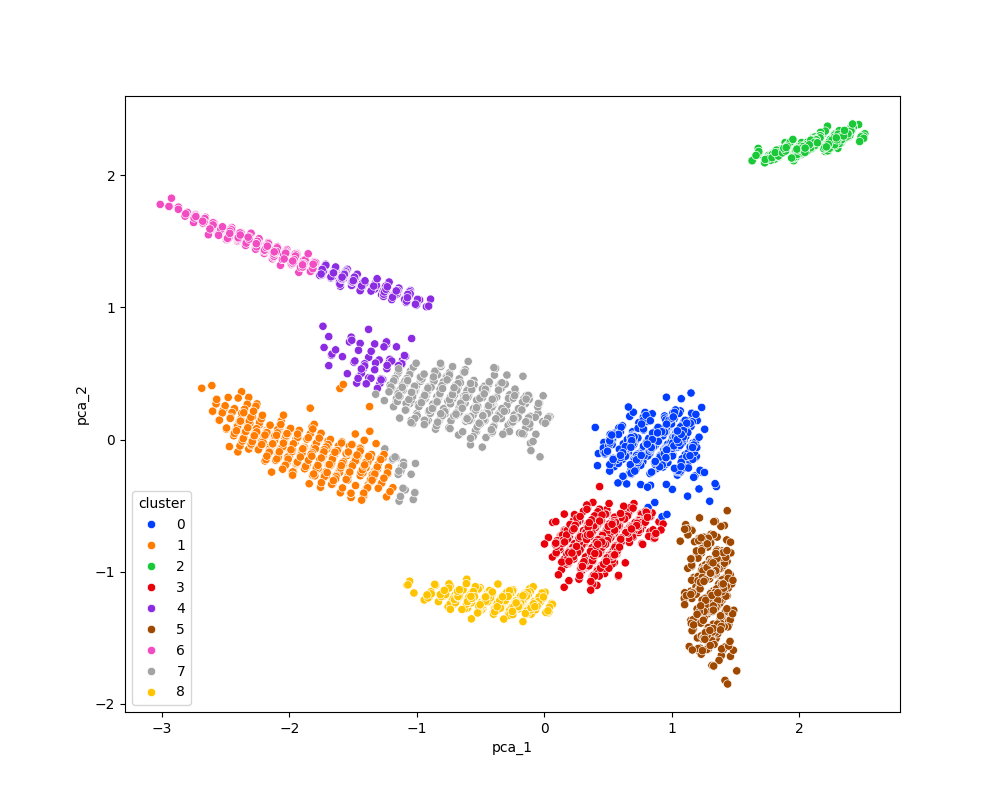

# 🐟 Fish Species Clustering Project

This project uses unsupervised learning (clustering) to group fish into species based on features in the dataset. Although the dataset already includes species labels, we remove them to test if **KMeans** clustering can discover species patterns based on the remaining data.

---

## 🐠 Fish Species in Dataset

The original dataset contains these species:

- Anabas testudineus  
- Coilia dussumieri  
- Otolithoides biauritus  
- Otolithoides pama  
- Pethia conchonius  
- Polynemus paradiseus  
- Puntius lateristriga  
- Setipinna taty  
- Sillaginopsis panijus  

We remove the species column before clustering to simulate **unsupervised learning**.

---

## 🧪 What the Project Does

1. **Preprocessing**
   - Remove species label column
   - Handle missing values if needed

2. **Data Scaling**
   - Use `StandardScaler` to normalize all numerical features

3. **Dimensionality Reduction**
   - Apply `PCA` to reduce dimensions for easier clustering and visualization

4. **Clustering**
   - Use `KMeans` to group fish into clusters
   - Compare clusters to real species (if needed for evaluation)

---

## 🧰 Tools Used

```python
import pandas as pd  
import numpy as np  
import seaborn as sns  
import matplotlib.pyplot as plt  
from sklearn.decomposition import PCA  
from sklearn.preprocessing import StandardScaler  
from sklearn.cluster import KMeans

--
## Cluster Result:


